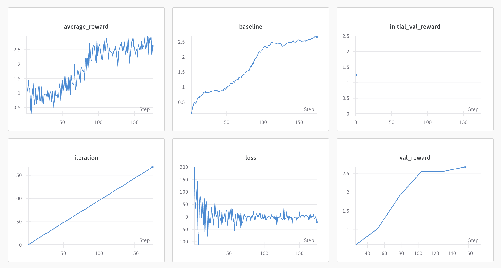

# back2basics_reinforce
Implementation of https://arxiv.org/pdf/2402.14740

## Tech instructions

Full pipeline

```bash
python run.py --config config.yaml
```

Train only reward model

```bash
python run.py --config config.yaml --only_reward_model
```

Train only reinforce

```bash
python run.py --config config.yaml --skip_reward_training
```

Evaluate and compare sft and reinforce models

```bash
python evaluate.py --config config.yaml --checkpoint_path reinforce_model/checkpoint-175
```

## Results

### Reinforce baseline



| Model | Eval Reward | Improvement |
|-------|-------------|-------------|
| SFT | 1.2507 | - |
| Reinforce | - | +x |


### Some samples from eval dataset


